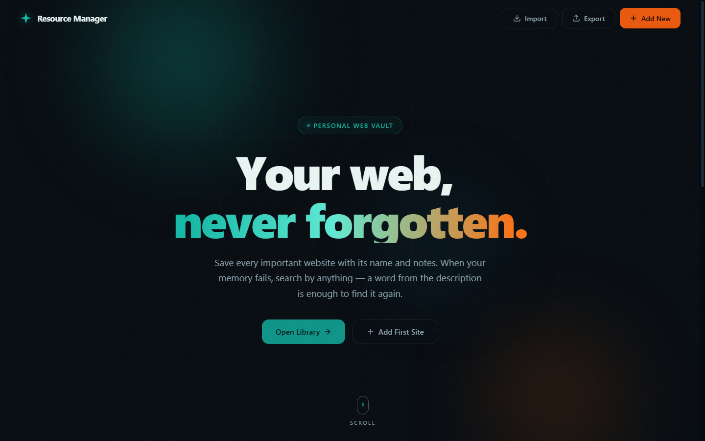
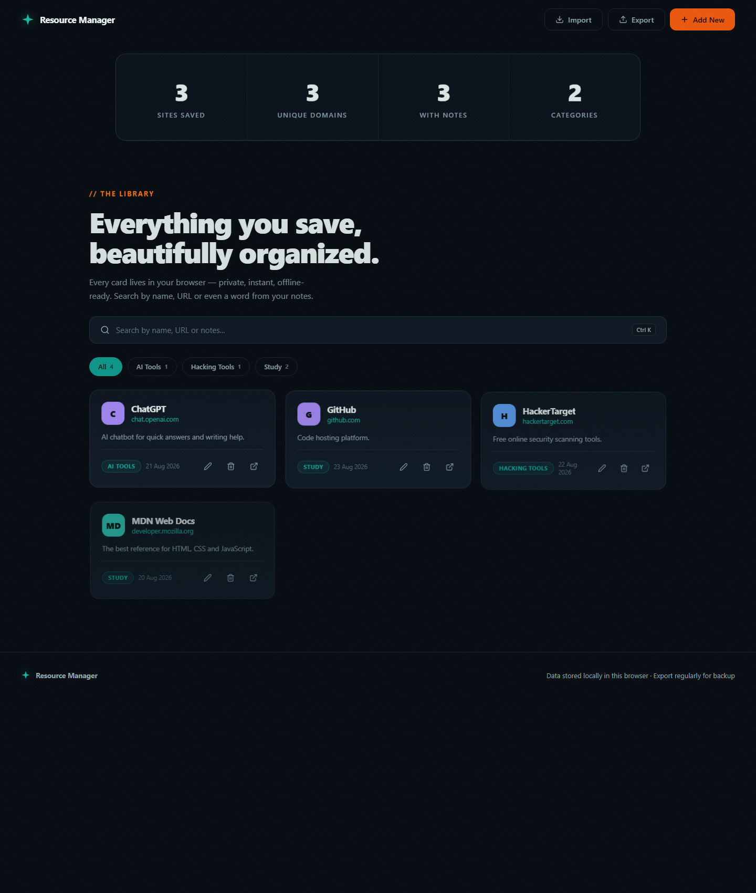

<div align="center">


# Resource Manager

### Your web, never forgotten.

*A beautiful, secure, offline-first personal web vault — save every important website with its name, category and notes, and find it again with a single search.*

[](#-security)
[](#-tech-stack)
[](https://github.com/Yuvii-007/Resource-Manager/pulls)
[](LICENSE)

[Features](#-features) · [Screenshots](#-screenshots) · [Security](#-security) · [Getting Started](#-getting-started) · [Roadmap](#-roadmap)

</div>

---

## Screenshots

| Hero | Library |
|:---:|:---:|
|  |  |

*Cinematic scroll-animated hero · Staggered card reveals · Category filters · Live search*

---

## ✨ Features

- 🔖 **Save Anything** — store websites with name, URL, description/notes and category
- 🗂️ **Categories** — group sites your way: *AI Tools, Hacking Tools, Study, Work…* with one-click filter chips and live counts
- 🔎 **Universal Search** — search by name, URL, notes **or** category; find a site even if you forgot its name (`Ctrl + K`)
- 📝 **Notes-first Design** — every card shows your notes, so future-you always knows *why* a site mattered
- 🎬 **Ultra-premium UI** — scroll-triggered reveals, staggered card animations, parallax hero, aurora background, mouse-spotlight cards, animated counters, scroll progress bar
- 🌗 **Dark Cinematic Theme** — flat design with teal & orange accent palette
- 🔒 **Private by Design** — everything stays in your browser's `localStorage`. No servers, no accounts, no tracking
- 📤 **Export / Import** — one-click JSON backup and restore, with strict validation
- ⚡ **Zero Dependencies** — a single HTML file. No build step, no CDN, no supply-chain risk. Works fully offline

---

## 🔐 Security

Security isn't an afterthought — the app ships with a **61-test automated security suite** (`security_test.mjs`) that tests the *real* production code.

| Protection | Implementation |
|---|---|
| **XSS Prevention** | All user input (name, notes, category) HTML-escaped before rendering — tested against 8+ payload classes |
| **URL Injection** | Strict scheme whitelist — only `http`/`https` can be opened; `javascript:`, `data:`, `vbscript:`, `file:` etc. are rejected |
| **Content Security Policy** | `default-src 'none'` — external scripts, frames, objects and connections are blocked at browser level |
| **No Referrer Leak** | `referrer: no-referrer` — opened sites never see your local path |
| **Import Validation** | Per-field length caps, malicious URLs silently dropped, UTF-8 BOM handling, chunked non-blocking import (tested with 200k+ items), quota-safe persistence |
| **Attribute Injection** | `aria-label`s and all HTML attributes escaped; delete confirmation uses `textContent` (no HTML parsing) |
| **Supply Chain** | Zero dependencies — nothing to compromise |
| **Input Caps** | Name 120 · URL 2048 · Notes 2000 · Category 40 characters |

Run the test suite yourself:

```bash
node security_test.mjs
```

---

## 🚀 Getting Started

No installation. No build. Just open it.

```bash
git clone https://github.com/Yuvii-007/Resource-Manager.git
```

Then double-click **`index.html`** — that's it.

> Windows users can use `Run Resource Manager.bat` for one-click launch.

Your data is stored in your browser's localStorage and survives app restarts. Use **Export** regularly to keep a JSON backup.

### ⌨️ Keyboard Shortcuts

| Shortcut | Action |
|---|---|
| `Ctrl + K` | Focus search |
| `Ctrl + N` | Add new resource |
| `Enter` | Save (in add/edit form) |
| `Esc` | Close dialog |
| Double-click title | Open site |

---

## 🧭 Legacy Desktop Version

This project started as a Python desktop app — `resource_manager.py` (Python 3.12 + CustomTkinter) is still included. Run it with:

```bash
pip install customtkinter
python resource_manager.py
```

---

## 📁 Project Structure

```
Resource-Manager/
├── index.html              # The entire web app (HTML + CSS + JS, zero deps)
├── security_test.mjs       # 61-test automated security suite
├── resource_manager.py     # Legacy desktop version (Python + CustomTkinter)
├── Run Resource Manager.bat
└── docs/
    ├── screenshot-hero.png
    └── screenshot-library.png
```

## 🛠 Tech Stack


- **Frontend:** Vanilla HTML/CSS/JS — IntersectionObserver reveals, CSS custom properties, `localStorage` persistence
- **Testing:** Node.js security test suite (61 tests)
- **Desktop (legacy):** Python 3.12 + CustomTkinter

---

## 🗺 Roadmap

- [ ] Drag & drop reordering
- [ ] Tags (multi-label) in addition to categories
- [ ] PWA support — installable app with offline sync
- [ ] Encrypted export (password-protected backups)
- [ ] Browser extension — save links from the address bar

## 🤝 Contributing

Contributions are welcome! Feel free to open an [issue](https://github.com/Yuvii-007/Resource-Manager/issues) or submit a pull request.

1. Fork the repo
2. Create your branch: `git checkout -b feature/amazing-feature`
3. Commit changes: `git commit -m "Add amazing feature"`
4. Push: `git push origin feature/amazing-feature`
5. Open a PR

## 📄 License

Distributed under the MIT License. See [`LICENSE`](LICENSE) for details.

---

<div align="center">

**⭐ Star this repo if you find it useful!**

Made with ❤️ by [Yuvii-007](https://github.com/Yuvii-007)

</div>
